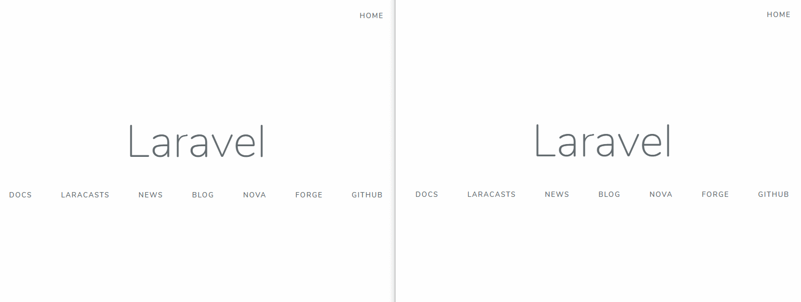

# laravel-websockets

This is a boilerplate to start with [Pusher](https://pusher.com/) & [Laravel](https://laravel.com/). Please see the [docs](https://docs.beyondco.de/laravel-websockets/) to understand how it works out of the box.



## Setup

Install packages:

```bash
$ composer install
```

Generate an app key:

```bash
$ php artisan key:generate
```

Run migrations:

```bash
$ php artisan migrate
```

Next, you should make sure to use Pusher as your broadcasting driver. This can be achieved by setting the BROADCAST_DRIVER environment variable in your .env file:

```bash
BROADCAST_DRIVER=pusher
```

## Redis (Optional)

Maybe you will need to use Redis to improve the performance of your application. Just make changes to your .env file:

```conf
CACHE_DRIVER=redis
QUEUE_CONNECTION=redis
SESSION_DRIVER=redis
```

## Pusher Key

You don't need a key from [Pusher webservice](https://pusher.com/channels/pricing). Just generate your own.

```conf
PUSHER_APP_ID=<YOUR_APP_ID>
PUSHER_APP_KEY=<YOUR_APP_KEY>
PUSHER_APP_SECRET=<YOUR_APP_SECRET>
```

## Starting the WebSocket server

Once you have configured your WebSocket apps and Pusher settings, you can start the Laravel WebSocket server by issuing the artisan commands:

```bash
$ php artisan serve
```

```bash
$ php artisan websockets:serve
```

```bash
$ php artisan queue:work
```

Now you must install NPM packages to work with Vue & Laravel Echo libraries.

```bash
$ npm install
```

Running watcher:

```bash
$ npm run watch
```

Done! Now you are ready to run the application by navigating to http://127.0.0.1:8000.

> [laravel-websockets](https://docs.beyondco.de/laravel-websockets/) gives you a nice way to monitor your WebSocket server statistics by navigating to http://127.0.0.1:8000/laravel-websockets.

> Please see [AuthServiceProvider](https://github.com/sayhicoelho/laravel-websockets/blob/master/app/Providers/AuthServiceProvider.php) to understand how to prevent unauthorized users to see the dashboard.

## Deploying using SSL with Nginx as a reverse proxy
1. Create a subdomain like `socket.yourdomain.com`
2. Install Nginx in your server
3. Install SSL for `yourdomain.com`, `www.yourdomain.com` and `socket.yourdomain.com`
4. Create a file at `/etc/nginx/sites-available/socket.yourdomain.com`
5. Setup the symbolic link to enable the new conf file: `$ sudo ln -s /etc/nginx/sites-available/socket.yourdomain.com /etc/nginx/sites-enabled/`
6. Configure the proxy with the content:

```conf
## WebSocket server
#
server {
  listen 443 ssl;
  listen [::]:443 ssl;

  server_name socket.yourdomain.com;

  location / {
    proxy_pass http://127.0.0.1:6001;
    proxy_read_timeout 60;
    proxy_connect_timeout 60;
    proxy_redirect off;

    # Allow the use of websockets
    proxy_http_version 1.1;
    proxy_set_header Upgrade $http_upgrade;
    proxy_set_header Connection 'upgrade';
    proxy_set_header Host $host;
    proxy_cache_bypass $http_upgrade;
  }

  ssl_certificate /etc/letsencrypt/live/yourdomain.com/fullchain.pem; # managed by Certbot
  ssl_certificate_key /etc/letsencrypt/live/yourdomain.com/privkey.pem; # managed by Certbot

  include /etc/letsencrypt/options-ssl-nginx.conf; # managed by Certbot

  ssl_dhparam /etc/letsencrypt/ssl-dhparams.pem; # managed by Certbot
}
```

## Install Supervisor to run WebSocket server in background

```bash
$ sudo apt-get install supervisor
```

### Configuring Supervisor

Create a file at `/etc/supervisor/conf.d/websockets.conf` and paste the content:

```conf
[program:websockets]
command=php /var/www/artisan websockets:serve --host=127.0.0.1
numprocs=1
autostart=true
autorestart=true
user=your_user
```

> The **--host=127.0.0.1** flag indicates the server will not expose the port 6001 to the web.

### Starting Supervisor

```bash
$ sudo supervisorctl reread

$ sudo supervisorctl update

$ sudo supervisorctl start websockets
```

Done! Now you can see the socket running on https://socket.yourdomain.com instead of http://yourdomain.com:6001.

## License

MIT
