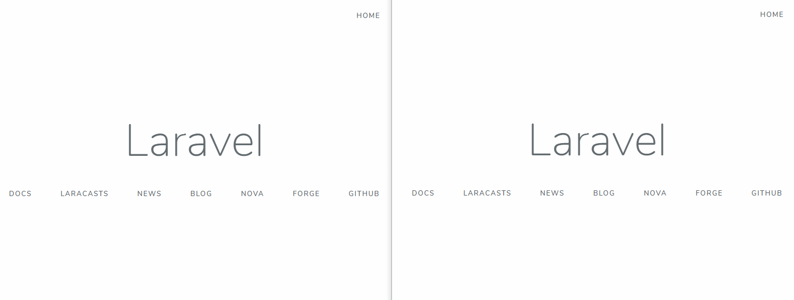

# laravel-websockets

This is a boilerplate to start with [Pusher](https://pusher.com/) & [Laravel](https://laravel.com/). Please see the [docs](https://docs.beyondco.de/laravel-websockets/) to understand how it works out of the box.



## Setup

Install packages:

```bash
$ composer install
```

Generate an app key:

```bash
$ php artisan key:generate
```

Run migrations:

```bash
$ php artisan migrate
```

Next, you should make sure to use Pusher as your broadcasting driver. This can be achieved by setting the BROADCAST_DRIVER environment variable in your .env file:

```bash
BROADCAST_DRIVER=pusher
```

## Redis (Optional)

Maybe you will need to use Redis to improve the performance of your application. Just make changes to your .env file:

```conf
CACHE_DRIVER=redis
QUEUE_CONNECTION=redis
SESSION_DRIVER=redis
```

## Pusher Key

You don't need a key from [Pusher webservice](https://pusher.com/channels/pricing). Just generate your own.

```conf
PUSHER_APP_ID=<YOUR_APP_ID>
PUSHER_APP_KEY=<YOUR_APP_KEY>
PUSHER_APP_SECRET=<YOUR_APP_SECRET>
```

## Starting the WebSocket server

Once you have configured your WebSocket apps and Pusher settings, you can start the Laravel WebSocket server by issuing the artisan commands:

```bash
$ php artisan serve
```

```bash
$ php artisan websockets:serve
```

```bash
$ php artisan queue:work
```

Now you must install NPM packages to work with Vue & Laravel Echo libraries.

```bash
$ npm install
```

Running watcher:

```bash
$ npm run watch
```

Done! Now you are ready to run the application by navigating to http://127.0.0.1:8000.

> Extra: As you can see, [laravel-websockets](https://docs.beyondco.de/laravel-websockets/) gives you a nice way to monitor your WebSocket server statistics by navigating to http://127.0.0.1:8000/laravel-websockets.
>
> Please see [AuthServiceProvider](https://github.com/sayhicoelho/laravel-websockets/blob/master/app/Providers/AuthServiceProvider.php) to understand how to prevent unauthorized users to see the dashboard.

## License

MIT
